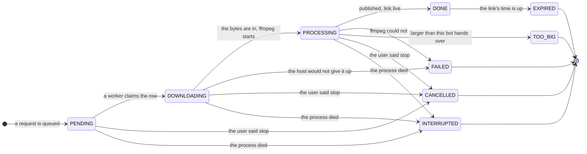

# The states of a job

The happy path is five states wide and the rest are ways of stopping. What matters about the
picture is not its shape but who is allowed to draw on it.

## Nothing outside this file moves a job

Every arrow above is drawn by code: a worker claiming a row, ffmpeg starting, a file being
published, a link expiring, a process dying. Nothing in the chat layer can write a state, and the
model — which now only ever answers with a `JobSpec` — could not name one if it tried.

That was not always true, and the reason it is now is in
[reading a message](reading-a-message.md): a state a model can write is a state that will
eventually be wrong, in the way that costs most, telling somebody their video is ready when
nothing was ever downloaded.

The **scenario** decides what runs inside the states, and only that:

| scenario | what runs | states it passes through |
|---|---|---|
| `DOWNLOAD` | video and audio streams, merged | PENDING → DOWNLOADING → PROCESSING → DONE |
| `EXTRACT_AUDIO` | the audio track, put into a container | PENDING → DOWNLOADING → PROCESSING → DONE |
| `TRANSCODE` | a download, then a re-encode to a smaller height | PENDING → DOWNLOADING → PROCESSING → DONE |

All three walk the same states. They differ in what runs inside them, which is exactly why the
states are about *phase* rather than about *kind of work*.

## One value carries the whole request

Whatever queues the work builds a `JobSpec` and hands it over. It is deliberately exhaustive: chat, scenario,
url, height, audio container, title. A transcode with no height asked for is normalised to 720p
*there*, an audio job's container defaults to m4a *there*, and a height on an audio job is cleared
*there* rather than ignored somewhere later.

The alternative — passing six loose arguments down and letting whoever needs one fill in the
blank — puts the shape of the work in two places, and two places disagree eventually. A worker
that defaults a missing height is a second decision-maker nobody declared.

## Why downloading and processing are told apart

They used to be one state, `IN_PROGRESS`. They fail differently: the first is somebody else's
server and the network, the second is this machine's CPU. They are paced differently: a download
reports steady progress, an encode can sit at one number for minutes. And they read differently to
a person watching — a bar that has been at 100% for two minutes looks like a stuck download when
it is ffmpeg doing exactly what it was asked to.

The transition is made when the phase begins, not when it first reports: `VideoDownloader` says so
before invoking the merge, `JobWorkers` before the re-encode, and `YtDlp` on yt-dlp's own
`[ExtractAudio]` line. Waiting for the first progress callback looks equivalent and is not — a
stream copy of a short video can finish without emitting one, and the job would step from
DOWNLOADING straight to DONE through a state the diagram claims it passes through.

`JobWorkers` writes the row once, on the first such signal, because progress callbacks arrive many
times a second and a state change is a write.

## EXPIRED is not a failure

`DONE` means the file exists and its link works. `EXPIRED` means the link's day was up, the file
was deleted, and the row is kept only so that somebody asking about job 12 is told to download it
again rather than being told nothing is known about it.

It is written by `ShortLinkService` when a link is swept, and it is the one state change that
happens long after the worker has forgotten the job.

## Rows written before the split

`IN_PROGRESS` no longer exists. Any row still carrying it belonged to a process that died, so it
is migrated to `DOWNLOADING` at startup — alongside the older `QUEUED` → `PENDING` and `RUNNING` →
`IN_PROGRESS` migrations, which are now two steps of the same chain. A state nothing writes any
more should stop existing rather than be understood forever.
